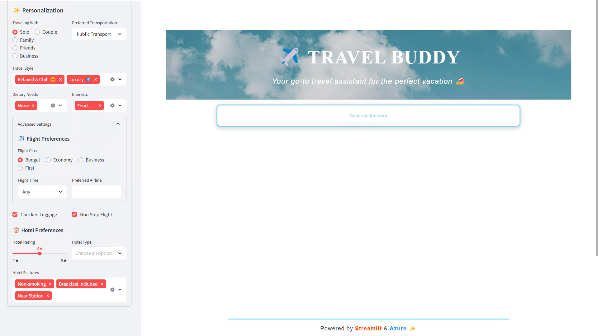

<a name="readme-top"></a>


<h1 align="center"> Travel Buddy – Agent-Based Travel Planning System </h1>
<h5 align="center">2025 Microsoft Hackathon </h5>
<p align="center">
    <a href="https://github.com/FlagOpen/FlagEmbedding">
            
    </a>
    <a href="https://github.com/stephanie0324/llm-agent-hack/stargazers">
        
    </a>
    <a href="https://github.com/stephanie0324/llm-agent-hack/forks">
        
    </a>
    <a href="https://github.com/stephanie0324/llm-agent-hack/issues">
        
    </a>
    <a href="https://github.com/stephanie0324/llm-agent-hack/tree/main?tab=readme-ov-file#MIT-1-ov-file">
        
    </a>
</p>


<div align="center">
    <p>
        <a href="#readme-top">Top</a> |
        <a href="#introduction">Introduction</a> |
    <h4 align="center">
    <p>
        <a href="#features">Features</a> |
        <a href="#technology-stack">Technology Stack</a> |
        <a href="#installation">Installation</a> |
        <a href="#configuration">Configuration</a> |
        <a href="#run-the-app">Run the App</a> |
        <a href="#example">Example</a> |
        <a href="#acknowledgements">Acknowledgements</a> |
        <a href="#license">License</a>
    </p>
  </h4>
  </p>
</div>

# New Updates
>　🎉　Travel Buddy is born on Apr 16, 2025


<p align="right">(<a href="#readme-top">back to top</a>)</p>

## Introduction

Travel Buddy is an agentic system built in Python and Streamlit. It combines:

- **Retrieval-Augmented Generation (RAG)** via Azure OpenAI
- **Tool Calling** for weather, flight, hotel, and activity lookups
- **Interactive UI** for multi-turn conversation and on-the-fly itinerary edits

to deliver a one-stop travel planning experience: from preferences → AI-generated options → direct booking links.

<div align="center">
<p class="image-cropper">
    
</p>
</div>

<p align="right">(<a href="#readme-top">back to top</a>)</p>

## Features

- **Smart Itinerary Generation**  
  Generates three distinct day-by-day plans based on dates, budget, interests, companions, and travel style.

- **Retrieval-Augmented Generation (RAG)**  
  Combines Azure OpenAI with Bing Search to fetch the latest travel information—opening hours, local events, hidden gems, and more.

- **Real-Time Data Retrieval**  
  Fetch weather (Weatherbit), flight, and hotel suggestions via custom APIs or AI services.

- **Agentic Tool Pipeline**  
  A REACT-style LLM agent (Azure OpenAI GPT-4o) orchestrates calls to:
  - `get_weather`
  - `search_flight`
  - `search_hotel`
  - `search_and_generate_itinerary`
  - `format_itinerary`

- **Conversational Modification**  
  Users can select activities to modify, submit instructions, and receive an updated full plan.

- **Direct Booking Links**  
  Surface “Book Now” URLs for flights and hotels without handling sensitive payments.

- **PDF Export & Sharing**  
  One-click export of any itinerary to PDF for easy sharing or printing.

<p align="right">(<a href="#readme-top">back to top</a>)</p>

## Technology Stack

- **Python 3.11+**
- **Streamlit** – Frontend UI
- **Azure OpenAI** – GPT-4o via `azure-ai-openai`
- **LangChain** – Agent orchestration & tool binding

<p align="right">(<a href="#readme-top">back to top</a>)</p>

## Installation

### Prerequisites
- Python 3.11+
- Azure OpenAI credentials (endpoint & key)
- Weatherbit API key

```bash
# Clone the repo
git clone https://github.com/stephanie0324/llm-agent-hack
```

### Build Docker Image

```bash
bash script/build-docker-image.sh
```

### Start the Application

```bash
docker-compose up -d
```

<p align="right">(<a href="#readme-top">back to top</a>)</p>

## Configuration

Copy and populate `.env` with:

```ini
AZURE_OPENAI_ENDPOINT=https://<your-endpoint>.openai.azure.com/
AZURE_OPENAI_KEY=<your-key>
WEATHERBIT_KEY=<your-weatherbit-key>
```

<p align="right">(<a href="#readme-top">back to top</a>)</p>

## Run the App

```bash
bash script/run-dev-mode.sh
streamlit run main.py --server.port=8501 --server.address=0.0.0.0 --server.runOnSave=True
```

Then open <http://localhost:8501> in your browser.

<p align="right">(<a href="#readme-top">back to top</a>)</p>

## Example

1. **Set Preferences**
   - Departure: Taipei
   - Destination: Tokyo
   - Dates: 2025-05-11 to 2025-05-13
   - Budget: TWD 30,000
   - Travel Style: Luxury, Food
   - Interests: Museum, Nature
  
    

2. **Generate Itineraries**
   - Click “Generate Itinerary”
   - Watch agent’s thought process & progress bar
   - View three summary cards, each with highlights and cost
    <video width="1920" height="1080" controls>
        <source src="./examples/GeneratePlans.mp4" type="video/mp4">
    </video>

3. **View Details & Modify Itinerary**
   - Select “View Details” on a card
   - Check activities you want to change
   - Enter instructions (e.g., “Replace sushi dinner with a Michelin ramen”)
   - Receive a full updated plan
    <video width="1920" height="1080" controls>
        <source src="./examples/ItineraryCustomization.mp4" type="video/mp4">
    </video>

4. **Export Itinerary & Book**
   - Click “Book Now” links for flights & hotels
   - Complete booking on third-party sites
   - Export itinerary
    <video width="1920" height="1080" controls>
        <source src="./examples/ConfirmPage_PrintFeature_Demo.mkv" type="video/mp4">
    </video>

<p align="right">(<a href="#readme-top">back to top</a>)</p>

## Acknowledgements

- LangChain
- Azure OpenAI Service
- Weatherbit API
- Python community libraries

<p align="right">(<a href="#readme-top">back to top</a>)</p>

<!-- LICENSE -->
# License

Distributed under the MIT License. See `LICENSE.txt` for more information.

<p align="right">(<a href="#readme-top">back to top</a>)</p>

## Other Projects
* [LLM Projects](https://github.com/stephanie0324/Finetune_LLM)
* [Web-Scraping](https://github.com/stephanie0324/Web-Scraping-)
* [Machine Learning with me](https://github.com/stephanie0324/ML_practrice)

<p align="right">(<a href="#readme-top">back to top</a>)</p>


<h3 align="left">Connect with me:</h3>
<p align="left">
<a href="https://github.com/stephanie0324/" target="blank"></a> <a href="https://www.facebook.com/profile.php?id=100005029028402&locale=zh_TW" target="blank"></a>
<a href="https://www.linkedin.com/in/stephanie-chiang-42100b165/" target="blank"></a>
<a href="https://www.instagram.com/yrs_2499?igsh=MXJ5MHNpc2ZxNHh5NA%3D%3D&utm_source=qr" target="blank"></a>
<a href="https://www.youtube.com/channel/UCpIrOv7O2R7HfpCEMQEOOKQ" target="blank"></a>
</p>